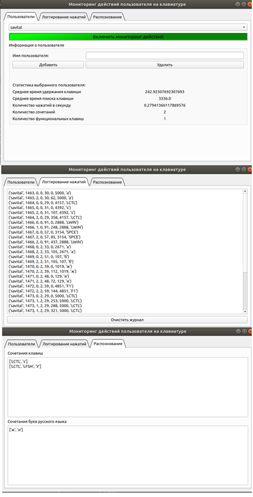

# Курсовой проект по курсу:

Операционные системы

## На тему:

Мониторинг действий пользователя на клавиатуре. Кейлоггер.

## Техническое задание:

Разработать загружаемый модуль ядра для сбора данных о времени удержания клавиш клавиатуры, времени перехода между соседними клавишами, уделяя особое внимание часто встречающимся в русском языке сочетаниям букв, горячим клавишам и т.п.

## Анализ

Анализируемые данные:

 * среднее время удержание клавишы;
 * среднее время поиска клавишы;
 * количество клавиш в миллисекунду;
 * использование сочетаний клавиш;
 * использование функциональных клавиш;
 * использование сочетаний букв русского языка.
 
## Решение

* Обработчик прерывания на линии IRQ1
* Односторонний буфер в фс /proc
* Приложение уровня пользователя
* База данных SQLite
 
## Интерфейс

